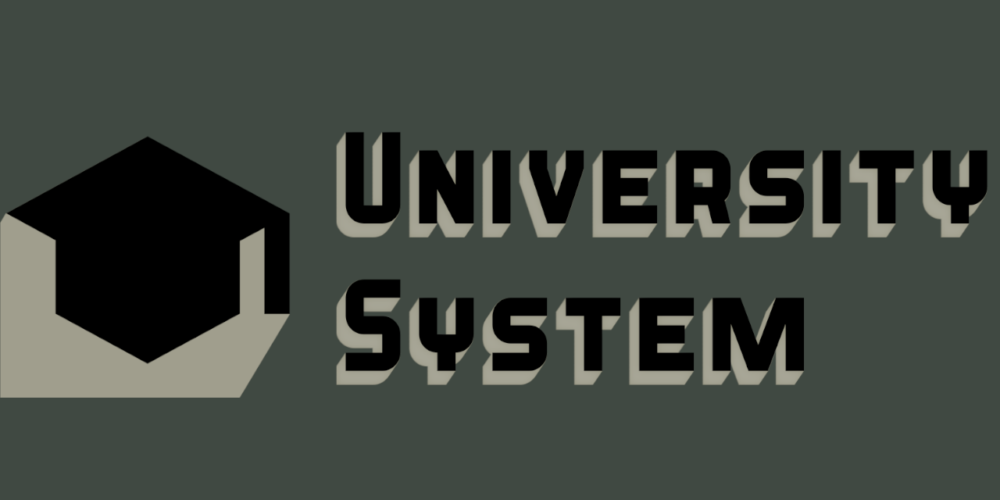
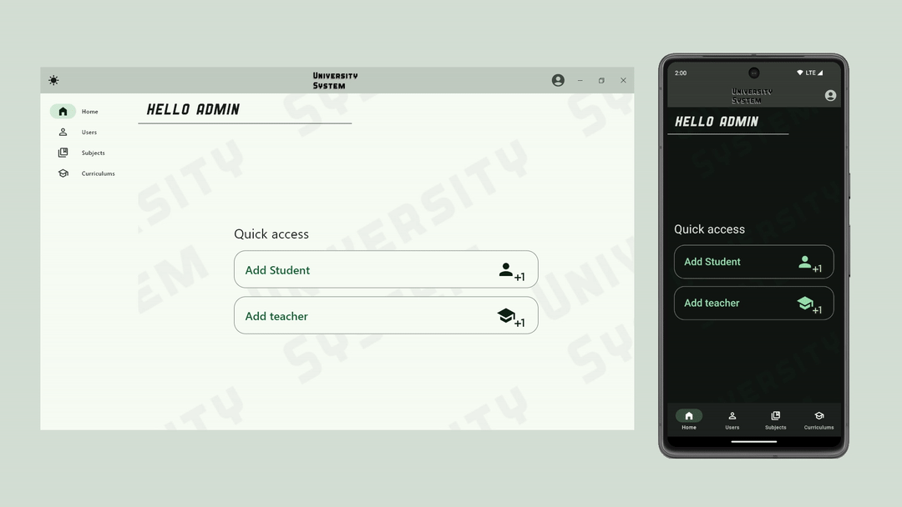
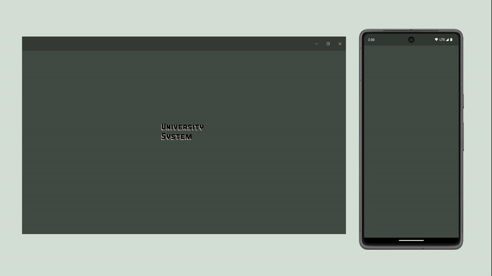
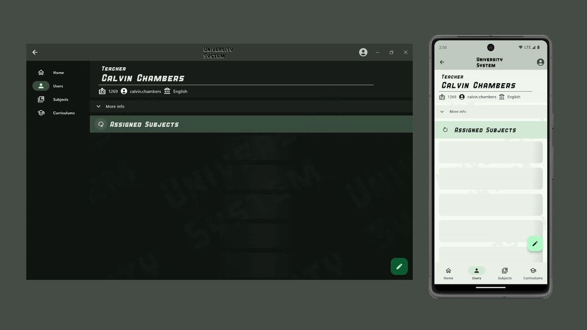
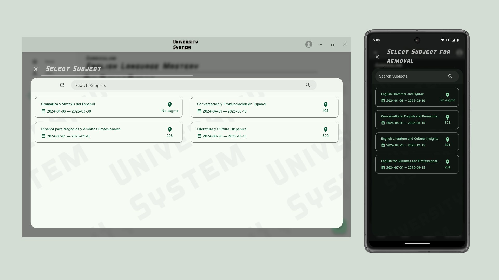
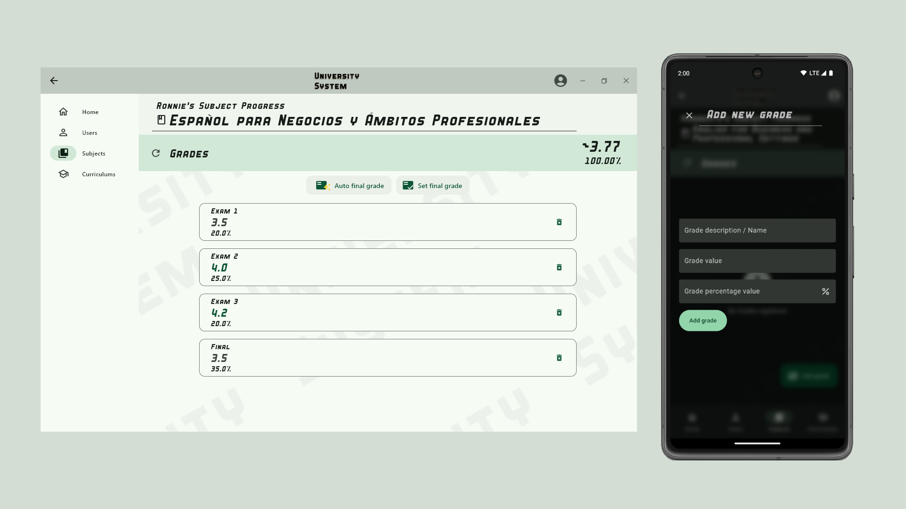

  

University System UI: A Comprehensive Flutter Learning Project
---

The University System UI is a robust learning project designed to explore and demonstrate the latest features of the Flutter framework. Built from the ground up, this project replicates the experience of developing a full-scale application, seamlessly running on both Windows and Android from a single codebase.

<picture>
  <source media="(prefers-color-scheme: dark)" srcset="./assets/readme/intro_dark_mode.gif">
  
</picture>

Key Features
---
- State Management With Riverpod
- Internationalization (i10n): Full English and Spanish translations.
- Theming and Branding Ideation: Complete brand identity with themes for a cohesive visual style.
- Best Practices: Designed with SOLID principles, MVC architecture, and compositional patterns to ensure scalable and maintainable code.
- Responsive Design: Optimized to deliver a seamless user experience across all screen sizes and devices.
- Multi-role: Supports different user flows for multiple user types.
- Custom Splash Animation: A seamless splash animation for a smooth user experience that works on all screens.
- Rich UI Animations: Animated title transitions, loading shimmer effects, and responsive interface interactions.
- JWT-Based Login System: Includes secure login, automatic logout, and automatic request headers for seamless authentication.
- Comprehensive Testing: Full coverage for the login subsystem with Widget, Unit, and Integration tests.
- Dynamic Infinite List Caching: Efficient and responsive data loading with advanced caching techniques.
- Advanced Navigation: Implements shell routes, redirects, and a sophisticated navigation architecture for a seamless user experience.
- Custom Dynamic AppBar: Tailored to function as a native title bar on Windows and a traditional AppBar on Android for platform-optimized UX.
- Auto Text Resizing:  Dynamic handling of text overflow for readability across devices.

University System UI shows how Flutter can be used to build cross-platform applications with a professional-grade feature set, emphasizing clean architecture, user experience, and maintainability.

UI Showcase
---
<picture>
  <source media="(prefers-color-scheme: dark)" srcset="./assets/readme/login_animation.gif">
  
</picture>
<picture>
  <source media="(prefers-color-scheme: dark)" srcset="./assets/readme/subject_info_dark_mode.gif">
  
</picture>
<picture>
  <source media="(prefers-color-scheme: dark)" srcset="./assets/readme/teacher_loading.gif">
  
</picture>
<picture>
  <source media="(prefers-color-scheme: dark)" srcset="./assets/readme/select_dark_mode.png">
  
</picture>
<picture>
  <source media="(prefers-color-scheme: dark)" srcset="./assets/readme/grades_dark_mode.png">
  
</picture>

Technology Stack
---
University System UI is a backend agnostic front end that implements a OpenAPI (Swagger) contract over a REST API.
The complete project stack includes:
- Flutter
- Riverpod
- Dart
- Spring Boot
- Java
- Hibernate ORM
- Docker
- PostgreSQL

See [UniversitySystem](https://github.com/kberriom/universitySystem) for more information on the server side implementation.

Figma Mockups
---

